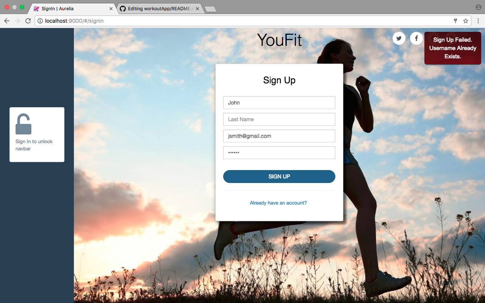

# YouFit

<!--  -->

Welcome to Youfit! A simple web application that allows users to customize and create their own workouts!

My name is Drew and I built this application to demonstrate my ability to learn new technologies.

The application's tech stack is: HTML/CSS, Bootstrap, Ecmascript6, Aurelia, Python, Python Flask, SQL

A quick walkthrough of how the website flows is below with a more in depth technical explanation coming soon.

## Signing Up as Admin

hello all

# Creating a Record

As Admin, you are given access to the basic CRUD operations

This is the "Create Record" interface.

 

 

If all fields are not filled in and the submit button is hit, the new exercise will not be created and a red notification banner will appear in the top right hand corner stating "Please Fill In All Fields!"

 

 

Another validation check occurs when the Admin tries to create an exercise twice. There already exists a chest exercise named "Flat Barbell Bench Press" in the database. When the Admin attempts to create the exercise a second time, a red notification banner will appear in the top right hand corner saying "Exercise Name Already Exists!"

 

# Reading a Record

hello

# Updating a Record

hello

# Deleting a Record

hello

# User Sign In

hello

