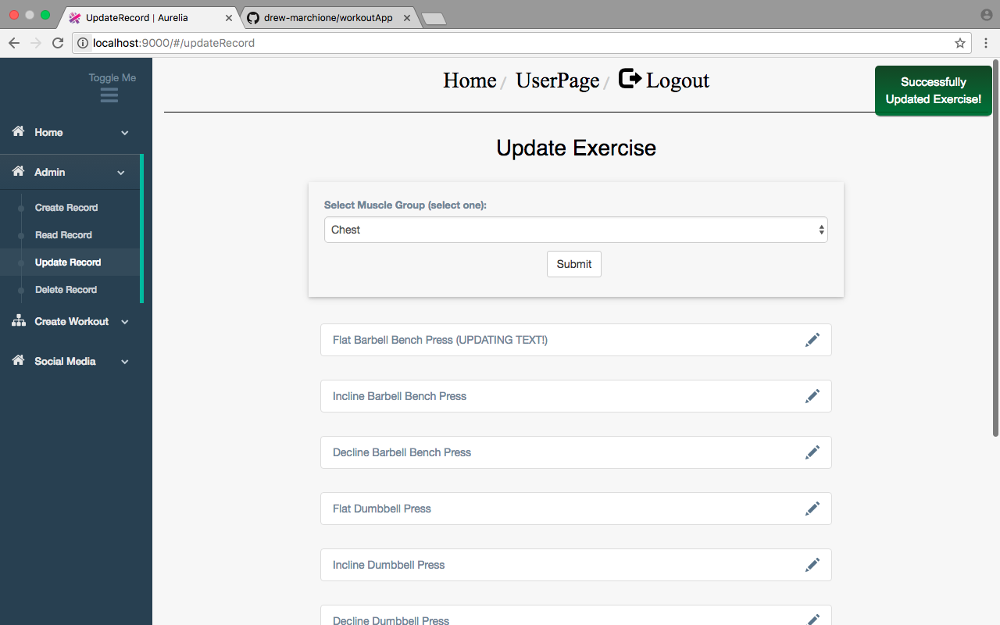

# YouFit

<!--  -->

Welcome to Youfit! A simple web application that allows users to customize and create their own workouts!

My name is Drew and I built this application to demonstrate my ability to learn new technologies.

The application's tech stack is: HTML/CSS, Bootstrap, Ecmascript6, Aurelia, Python, Python Flask, SQL

A quick walkthrough of how the website flows is below with a more in-depth technical explanation coming soon.

## Signing Up as Admin

This will teach you how to use YouFit as Admin and a regular user.

1) So first things first, this is the sign in and sign up homepage of YouFit. Right now the sign in panel is visible, but if you click on "Create new account?" the panel will flip over to the sign up panel.

2) Since Admin has yet to be created, we must click "Create new account?" to sign up an Admin. To sign up as Admin and have access to the create, read, update, and delete operations make sure the username = Admin and the password can be anything you want.

 

3) As long as all fields are filled in and this is the first time creatng a user called "Admin", the sign up will be successful (We will look at sign in and sign up validation in greater detail later in this tutorial). The Admin is brought to the homepage of the website. Notice the sidebar menu and how one of the tabs is called "Admin". This tab will only appear for the admin and never for any other user.

 

 

4) Before we start navigating around the website we will show a logout and Admin sign in. Click the logout button at the top of the page. The Admin will be redirected back to the sign in and sign up page. A green success notification will inform the admin of a successful logout. Since the Admin's credentials now exist in the database, all the Admin has to do is sign in (note: different than sign up). 

 

 

5) Enter the Admin username and password into the sign in form.

 

 

6) And now we are logged back into the homepage again.

 

# Creating a Record

As Admin, you are given access to the basic CRUD operations

1) This is the "Create Record" interface.

 

 

2) If all fields are not filled in and the submit button is hit, the new exercise will not be created and a red notification banner will appear in the top right hand corner stating "Please Fill In All Fields!"

 

 

3) Another validation check occurs when the Admin tries to create an exercise twice. There already exists a chest exercise named "Flat Barbell Bench Press" in the database. When the Admin attempts to create the exercise a second time, a red notification banner will appear in the top right hand corner stating "Exercise Name Already Exists!"

 

 

4) If all fields are filled in and the exercise name is different from those in the database, then the exercise is created successfully

 

 

5) On the side navbar click "Create Workout" --> "Upper Body" --> "Chest".  Scroll to the bottom and there is the new exercise we just created!

 

# Reading a Record

1) This is the "Read Record" interface. Here you may select a muscle group and view the exercises that are associated with it.

 

 

2) When you have selected the muscle group, click "submit". This will render a list of all the exercise names that belong to the muscle group.

 

 

3) To view each exercise's properties, click on the icon to the right.  A modal will pop up displaying the properties. The fields are disabled as this is solely for viewing purposes.

 

# Updating a Record

1) This is the "Update Record" interface. Here you can modify any existing exercise.

 

 

2) When you have selected the muscle group, click "submit". This will render a list of all the exercise names that belong to the muscle group.

 

 

3) To view each exercise's properties, click on the icon to the right. A modal will pop up displaying the properties. Here you can modify the exercise data. We will modify the "Flat Barbell Bench Press" exercise.

 

 

4) We will test a few validation cases before showing a successful update. The first being a duplicate naming error. In this example we have selected "Flat Barbell Bench Press" which is the first chest workout. Here, we change its name to "Incline Barbell Bench Press" which happens to already exist as our second chest workout. When you hit the update button an error will be thrown as you cannot have two exercises named "Incline Barbell Bench Press".

 

 

5) As you can see, a red error notification appears in the top right corner. The exercise data is restored back to it's original name of "Flat Barbell Bench Press".

 

 

6) The next validation case we will test is entering a null value into a field. If we simply hit backspace and empty the value, the update will fail.

 

 

7) We can see the null value cause the fail here.

 

 

8) Now, to see a successful update in action, we will modify the exercise name of "Flat Barbell Bench Press". Notice how I added "(UPDATING TEXT!)" to the end of the exercise name. Click the "update" button.  

 

 

9) Upon a successful update a green success notification will appear in the top right corner. You can also see the updated name down below.

 

 

10) To check our updated exercise click "Create Workout" --> "Upper Body" --> "Chest". This is also what the exercise will now look like to the users who do not have Admin privileges.

 

# Deleting a Record

1) This is the "Delete Record" interface. Here you can delete an exercise from the database.

 

 

2) When you have selected the muscle group, click "submit". This will render a list of all the exercise names that belong to the muscle group.

 

 

3) To view each exercise's properties, click on the icon to the right. A modal will pop up displaying the properties. Here you can delete an exercise. Notice how we are deleting "Flat Barbell Bench Press(UPDATING TEXT!)" which is the first chest exercise in the list.

 

 

4) Click "delete" and watch the exercise disappear! Now our first chest exercise is "Incline Barbell Bench Press"

 

 

5) Let's double check what it will look like for our users by clicking "Create Workout" --> "Upper Body" --> "Chest". Just like we thought, our first exercise is "Incline Barbell Bench Press" which means "Flat Barbell Bench Press(UPDATING TEXT!)" was deleted from the database successfully.

 

# User Sign Up

Ok, so that wraps up the Admin's capabilities. Now let's focus on what the website looks like for an everyday user.

1) This is the sign up interface. If a user has already signed up they can click "Already have an account?" and the panel will flip over to a sign in form. For this tutorial we will assume the user is new to the website.

 

2) Let's enter some credentials

 

 

3) As long as the username doesn't exist, the user will be signed up successfully.  If the username exists, an error will be thrown and it will look like this:

 

 

4) Assuming the username jsmith@gmail.com hasn't been used yet, the user is created successfully. The first thing to notice is that the sidebar menu does not have the Admin dropdown tab. Using Aurelia's data-binding, whenever the username is anything other than "Admin", the Admin dropdown tab is hidden.  

 

 

5) Click on the "UserPage" link at the top of the website. Here is John Smith's own personalized workout page. Right now it is empty, but by clicking on the "Create Workout" tab, John Smith can customize and add exercises to his UserPage.

 

 

6) You can select a muscle group and scroll through the exercises associated with it.

 

 

7) Once you find an exercise you want to add to your workout click "customize". A modal will pop up which allows you to enter a custom number of sets and reps for the exercise.

 

 

8) If you try to enter a null value into the fields then the exercise add will be unsuccessful.

 

 

9) A red error notification will alert you in the top right corner of the screen.

 

 

10) Assuming the fields are filled in and not null, the exercise will successfully be added to your workout!

 

 

11) A green success notification will alert you in the top right corner of the screen.

 

 

12) Now, let's click on the "UserPage" tab at the top of the website. We can see John Smith's workout page is populated with the "Flat Barbell Bench Press" exercise with 3 sets and 8 reps. It worked!

 

 

13) Feel free to use the sidebar to customize other exercises to add to your workout as well!

 

 

14) At any point you can quickly delete an exercise from your workout page as well.

 

 

15) Last thing is the logout method. At any time a user wants to logout they must simply press the "Logout" tab at the top of the website. They will be redirected to the sign in page.

 

 

16) When Logging back in, each user's credentials are saved, so your "UserPage" will have the exercises you added last time you were logged in.

    That's a Wrap!

 
